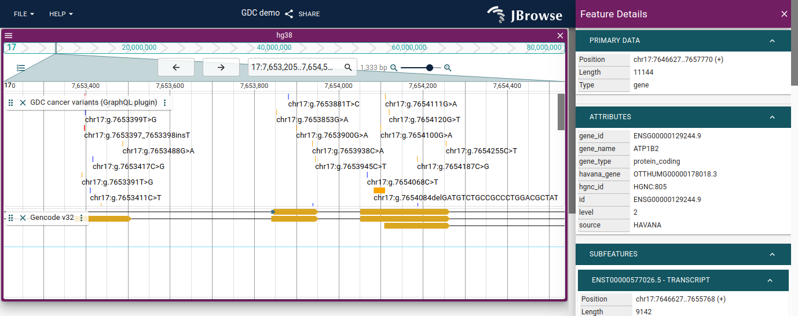

# `jbrowse-plugin-gdc`

> JBrowse 2 plugin for the NCI Genomic Data Commons ([GDC](https://gdc.cancer.gov/))

## Install

### For use in [JBrowse Web](https://jbrowse.org/jb2/docs/quickstart_web)

No installation required

### For use in [`@jbrowse/react-linear-view`](https://www.npmjs.com/package/@jbrowse/react-linear-genome-view)

```
yarn add jbrowse-plugin-gdc
```

## Usage

### In [JBrowse Web](https://jbrowse.org/jb2/docs/quickstart_web)

#### Development

```
git clone https://github.com/GMOD/jbrowse-plugin-gdc.git
cd jbrowse-plugin-gdc
yarn
yarn start
```

Then open JBrowse Web to (assuming it is running on port 3000):

http://localhost:3000/?config=http://localhost:9000/config.json

#### Production

Add to the "plugins" of your JBrowse Web config:

```json
{
  "plugins": [
    {
      "name": "GDC",
      "url": "https://unpkg.com/jbrowse-plugin-gdc/dist/jbrowse-plugin-gdc.umd.production.min.js"
    }
  ]
}
```

### In [`@jbrowse/react-linear-view`](https://www.npmjs.com/package/@jbrowse/react-linear-genome-view)

```tsx
import React from 'react'
import 'fontsource-roboto'
import {
  createViewState,
  createJBrowseTheme,
  JBrowseLinearGenomeView,
  ThemeProvider,
} from '@jbrowse/react-linear-view'
import GDC from 'jbrowse-plugin-gdc'

const theme = createJBrowseTheme()

function View() {
  const state = createViewState({
    assembly: {
      /* assembly */
    },
    tracks: [
      /* tracks */
    ],
    plugins: [GDC],
  })
  return (
    <ThemeProvider theme={theme}>
      <JBrowseLinearGenomeView viewState={state} />
    </ThemeProvider>
  )
}
```

## Screenshot


